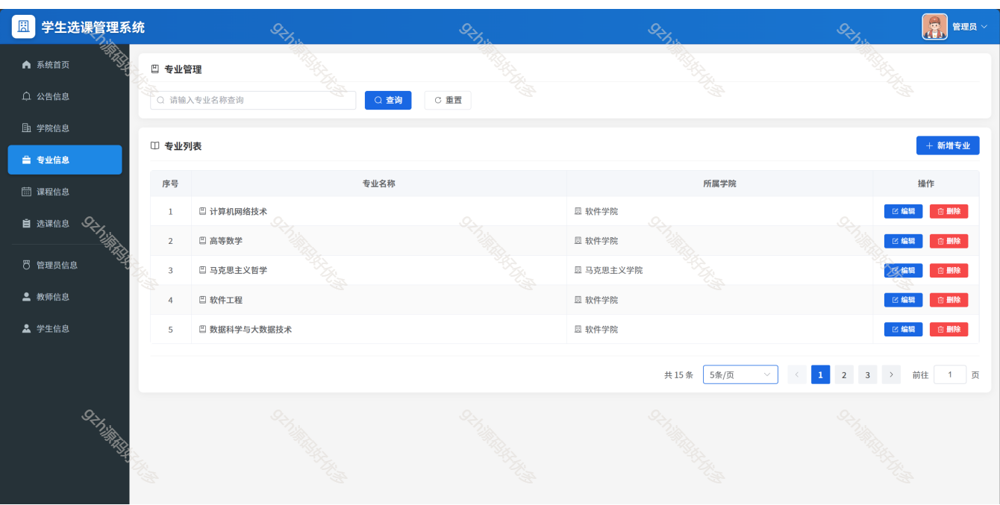

# springbootA377
springbootA377学生选课课程管理系统
 
## 查看主页获取源码

### 一、关键词

学生选课系统、选课系统

 

### 二、作品包含

源码+数据库+万字文档+全套环境和工具资源+部署教程

 

### 三、项目技术

前端技术： vue3 Element Plus Axios Echarts
后端技术：Java、SpringBoot、MyBatis

  

 

### 四、运行环境（以下版本亲测，其他版本未知，请自测）

开发工具：IDEA/eclipse  + VSCODE

数据库：MySQL8

数据库管理工具：Navicat10以上版本

环境配置软件： JDK21 + Maven3.6.3

前端Nodejs：16

浏览器：谷歌浏览器

 

### 五、项目介绍

项目编号：springbootA377

本论文主要介绍的是以前后端分离模式基于Springboot3+vue3实现的在线学生选课系统，主要描述了学生选课系统的页面分析与设计，数据库设计，后端和前端数据进行交互的全部过程结合E-R图，程序流程图等对系统的设计过程详细的描述

课程管理系统分管理端、教师端、学生端，管理端可进行系统、信息（含公告等多类）、用户（管理员、教师、学生）及个人资料等管理；教师端和学生端均含系统首页、信息（学院、专业等）、个人资料等功能，实现课程教学全流程数字化管控 。

 

### 六、运行截图

